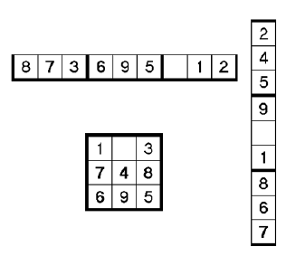
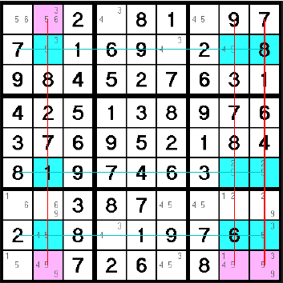

# Abstract

&nbsp;&nbsp;&nbsp;&nbsp;
This paper attempts to analyze the key factors that contribute to the difficulty of Sudoku puzzles using data mining and machine learning techniques.
Understanding the contributing factors to Sudoku difficulty may lead to a deeper knowledge and understanding of other similar puzzles that may be applied to the real world in the future.
We applied a variety of machine learning techniques, but unfortunately, as is often the case in real-world problems, our experiments did not produce the results we desired.
We found that data mining and machine learning techniques were unable to uncover the complex relationship between the puzzles and their difficulties and that this task is better suited for traditional, sudoku-specific algorithms.
The source code for this paper can be found here: https://github.com/ryantran2165/sudoku-difficulty.

# Introduction

&nbsp;&nbsp;&nbsp;&nbsp;
Sudoku, dating all the way back to the 19th century, is one of the world's most famous and popular logic-based puzzles.
The objective in Sudoku is to complete a 9x9 grid of numbers, from one to nine, such that each row, column, and each of the nine 3x3 subgrids contain each digit exactly once.
The puzzle begins in a partially completed state with pre-filled digits or "clues" as we call them in this paper.
Sudoku puzzles each have a single unique solution, and the difficulty in finding such a solution varies wildly from absolutely trivial to seemingly impossible.

&nbsp;&nbsp;&nbsp;&nbsp;
We will be using a Kaggle dataset that provides us with three million samples, each with four features: puzzle, solution, clues, and difficulty.
We are given the puzzle as a string of 81 characters representing the 81 possible grid cells.
Initial clues are given as their respective numerical digit and unknown values to be discovered are represented with a period character.
We are also provided with the solution of the puzzle, though in this case, we will not be utilizing it for our purposes.
Another possibly useful piece of information is the number of initial clues, which we will be extensively analyzing for possible insights.
Lastly, we are given the estimated difficulty of the puzzle.
Sudoku difficulty is not an objective measure, since there are so many different rating systems.
For this dataset, the difficulty was calculated based on the average depth of search trees over ten attempts.

&nbsp;&nbsp;&nbsp;&nbsp;
In this paper, we will utilize a variety of statistical methods from statistics, data mining, and machine learning in an attempt to uncover insights into the key determining factors of Sudoku puzzle difficulty.
More specifically, we will be taking a closer look at how the number of missing values, the values of the digits themselves, and the structure of such values affect the difficulty of the Sudoku puzzles.

# Methods

### Association Analysis

&nbsp;&nbsp;&nbsp;&nbsp;
Association analysis is a method for finding hidden relationships within datasets.
This is performed through the use of frequent itemsets or through association rules.
Frequent itemsets are sets of items that occur together often, and association rules indicate the probability of strong relationships between two sets of items.
This method of analysis is not useful for our problem because even though we are attempting to find a relationship between the puzzle and its difficulty, the notion of itemsets is not applicable.

### Classification

&nbsp;&nbsp;&nbsp;&nbsp;
Classification is a method for assigning discrete classes to items.
In our case, classification algorithms are not useful because our problem attempts to predict a continuous value, the puzzle difficulty, and not categorize puzzles into different classes.

### Regression

&nbsp;&nbsp;&nbsp;&nbsp;
Regression is a method for predicting continuous numerical values based on dependent variables that have a relationship to the target value.
Our problem of predicting puzzle difficulty given the incomplete puzzle is this very exact task.
Therefore, the vast majority of our experiments will be based on regression models.

### Clustering

&nbsp;&nbsp;&nbsp;&nbsp;
Clustering is a method for grouping similar objects into clusters.
This means we need a metric for determining the similarity of objects. In the context of this problem, it is unclear how one would determine the similarity of Sudoku puzzles.
Furthermore, this form of unsupervised clustering is not related to our task of predicting a continuous value.

### Dimensionality Reduction

&nbsp;&nbsp;&nbsp;&nbsp;
Dimensionality reduction is a method for reducing the number of features in a dataset such that most of the important meaning and information behind the data is retained.
Dimensionality reduction helps reduce the curse of dimensionality, which is a phenomenon that causes poor model performance due to the sparsity of the data.
In our case, the only data we have is the puzzle itself. If we treat each of the 81 numbers as features, then we have an 81-dimensional feature space, which is rather large.
However, each and every one of the numbers is crucial to the puzzle, so performing dimensionality reduction is not a good idea.

# Experiments and Analysis

### Clues Distribution

&nbsp;&nbsp;&nbsp;&nbsp;
First, we will look at the distribution of the number of clues.
From Figure 1, we can see that the number of clues is somewhat normally distributed and centered at around 24 clues.
The vast majority of clues are between 23 and 26.

### Difficulty Distribution

&nbsp;&nbsp;&nbsp;&nbsp;
Next, we look at the distribution of difficulties.
We notice that the distribution is extremely right skewed due to there being so many samples of 0.0 difficulty, puzzles on the easier spectrum.
There are over one million samples of 0.0 difficulty, while the next most common difficulty of 1.0 had about 90,000 samples.
We decided to reduce this discrepancy by randomly sampling 100,000 of the 1,000,000 samples of 0.0 difficulty.
Though after the reduction, the difficulty distribution is still rather right skewed as seen in Figure 2.

### Difficulty-Clues Relationship with Linear Regression and Random Forests

&nbsp;&nbsp;&nbsp;&nbsp;
Next, we attempt to uncover the relationship between the number of clues and difficulty.
As seen in Figure 3, there is not a clear-cut relationship between the number of clues and difficulty.
We somewhat expected the relationship to clearly indicate that more clues would result in lower difficulty, but the plot says otherwise.
However, it can be noted that there is something to be said about the relationship between maximum difficulty and the number of clues.
What's surprising is that this relationship is not monotonic.
It seems the number of clues that results in the maximum difficulty is 23.
Then, the maximum difficulty decreases as you either increase above or decrease below 23 clues.
We then trained a linear regression model and a random forest model using the number of clues to try and predict difficulty.
As expected, we were unable to fit such models and resulted in R squared values of nearly zero, indicating that the models were completely unable to fit the data.
Thus, it is highly likely that the number of clues alone is not a good predictive independent variable for the dependent difficulty variable.

### Puzzle-Clues Relationship with Vanilla and Convolutional Neural Networks

&nbsp;&nbsp;&nbsp;&nbsp;
Next, we try to use neural networks to find correlations between the puzzle itself and the difficulty.
There are two approaches to using the puzzle data: numerical and binary.
The numerical approach is to retain the actual numerical values of the digits in the puzzle.
The binary approach is to convert all numerical values to the value 1 and all missing places to the value 0.
We hypothesized that the numerical values may or may not be significant and that maybe simply the position in which digits existed may be the key factor.
We attempted using vanilla neural networks as well as convolutional neural networks with both the numerical and binary approaches, but we came up empty with R squared values near zero once again.
We thought maybe vanilla neural networks could uncover some insights that were not immediately obvious to humans and that convolutional neural networks could take advantage of the natural grid structure of Sudoku puzzles, but unfortunately, we were unable to attain desirable results.
There could be many reasons why we did not achieve the results we desired.
It could be that our models are simply not complex enough to capture the true relationship between the puzzle and difficulty.
It could also be that it is simply not possible to reliably predict difficulty from the puzzles using data mining and machine learning techniques.
This could very well be the case because from our exploratory data analysis, there was incredible overlap between difficulties with very similar looking puzzles and numbers of clues.

### The Missing Insight

&nbsp;&nbsp;&nbsp;&nbsp;
It turns out that the number of clues has very little to do with the difficulty of Sudoku puzzles, and the true key factors are the number of steps required and the technique difficulty of those steps [@ref1]. There are several common techniques to solve Sudoku puzzles, with technique complexity varying greatly from the most basic Open Singles technique to the extremely complicated Swordfish technique. The basic Open Singles technique, as seen in Figure 4, simply looks for a row, column, or block with a single remaining cell and only one option remaining. The advanced Swordfish technique, as seen in Figure 5, comprises of complex deductive reasoning logic and requires attention across multiple blocks. Knowing that techniques as complicated as Swordfish are required to solve certain puzzles, it is no longer surprising that our machine learning models struggled to find a relationship between the puzzle and its difficulty given just the number of clues or the raw puzzle alone.

# Comparisons

&nbsp;&nbsp;&nbsp;&nbsp;
Unfortunately there was no direct keggle example to compare our experiments against with the same goals. Most related notebooks, of which there were only two, focused on data exploration and solving the sudoku problems rather than tackling the problem of correlating difficulty to each puzzle. The notebooks available for comparison with the same dataset were also partially complete. Stated above are the methods we used to conduct our experiments.

# Conclusion

&nbsp;&nbsp;&nbsp;&nbsp;
In this paper we try to find patterns affecting the difficulty of solving a sudoku puzzle. We have used a pre-built dataset of 3 million entries which included the puzzle, solution, # of clues and it’s difficulty.

First we find different distributions in the puzzle like empty spaces distribution and clue distribution and find that they followed a normal distribution.

We then try finding the relationship between clues and difficulty using different models like linear regression and random forest thinking it would turn out to be a linear relationship. However, the relationship turns out to be non-linear. The difficulty increases with the number of clues and peaks at a particular point before decreasing again.

We then turn to neural networks hoping to find the correlation between clues and difficulty. Unfortunately, even after trying different types of neural network models like Vanilla NN, CNN and even two layer CNN we couldn’t establish a relationship between the said fields.

In the end, we conclude that either there’s no such relationship between clues and difficulty or it would require more sophistication on the implementation side of the models to find a better relationship.

# References
